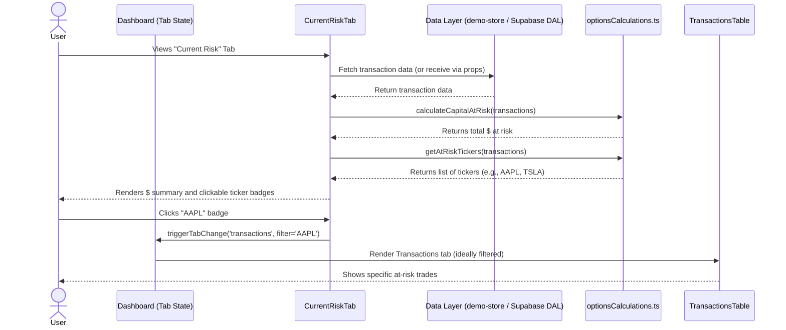

# Feature Ticket: Capital at Assignment Risk Summary

## Status
pending-implementation

## Context
Options traders face significant risk when selling options (short positions), specifically when the position is nearing expiration. Currently, OptionsBookie allows users to track their open trades in the Transactions tab. However, looking at individual rows doesn't quickly tell a trader "How much total capital or how many shares are at risk this week?" Users need a dashboard view that aggregates their near-term assignment risk across all open short positions, rather than manually scanning a table.

## Objective
Provide a "Capital at Assignment Risk" summary widget in the `CurrentRiskTab`. This widget must aggregate the total collateral tied up in short options expiring within the next 7 days, and list the specific tickers driving that risk as clickable links that navigate the user directly to the relevant trades in the Transactions tab.

## Scope
- In scope:
  - Add an aggregated metric to `CurrentRiskTab`: "Total Capital at Risk (Next 7 Days): $X".
  - Below the total metric, list the specific tickers that make up this risk bucket.
  - Make each ticker in the list a clickable link that navigates the user to the "Options Trades" (Transactions) tab, pre-filtered or scrolled to those specific open trades (or simply navigating to the tab if filtering is too complex).
  - The risk criteria are strictly: the transaction is a short option, `status === 'Open'`, and the time to expiration (DTE) is 7 days or less.
  - Create pure functions in `src/utils/optionsCalculations.ts` to calculate the total capital at risk and extract the list of at-risk tickers.
- Out of scope:
  - Fetching live underlying prices to determine exact "moneyness".
  - Adding new pages or altering the historical analytics views.
  - Sending push notifications or emails.

## UX & Entry Points
- Primary entry: The "Current Risk" tab (`src/components/analytics/CurrentRiskTab.tsx`).
- Components to touch:
  - `src/components/analytics/CurrentRiskTab.tsx`: Add the new "Capital at Risk (Next 7 Days)" summary widget/section.
  - The main dashboard or tab navigation logic (if needed to handle the click-through from a ticker to the Transactions tab).
- UX notes: The widget should act as a proactive "Next Action Required" dashboard element. The total dollar amount should be prominent. The list of tickers underneath should look like interactive badges or links. Clicking a ticker badge should ideally switch the active tab to the Transactions view so the user can immediately manage the trade.

## Tech Plan
- Data sources / utils:
  - Existing `transactions` array passed to `CurrentRiskTab`.
  - Add `calculateCapitalAtRisk(transactions: Transaction[], daysThreshold: number = 7): number` to `src/utils/optionsCalculations.ts` to sum the collateral of open short trades expiring within the threshold.
  - Add `getAtRiskTickers(transactions: Transaction[], daysThreshold: number = 7): string[]` to `src/utils/optionsCalculations.ts` to return a unique list of tickers meeting the criteria.
- Files to modify / add:
  - `src/components/analytics/CurrentRiskTab.tsx` (to render the summary widget and ticker links).
  - `src/app/page.tsx` or the relevant parent component managing tab state (to allow `CurrentRiskTab` to trigger a tab change when a ticker is clicked).
  - `src/utils/optionsCalculations.ts` (to add the new aggregation functions).
  - `src/utils/optionsCalculations.test.ts` (to add tests for the new utilities).
- Risks / constraints:
  - Tab navigation state might need to be lifted up or passed down via props so `CurrentRiskTab` can programmatically switch to the Transactions tab.
  - The calculations must remain pure functions in `src/utils/` to adhere to the Thick Client architecture.

## Sequence Diagram (High-Level)

## Acceptance Criteria
- [ ] In the "Current Risk" tab, an aggregated "Total Capital at Risk (Next 7 Days)" metric is correctly displayed.
- [ ] The view lists unique tickers that contribute to this risk bucket.
- [ ] Clicking a ticker navigates the user to the Transactions tab.
- [ ] The aggregated calculation correctly sums collateral ONLY for open short positions expiring in 7 days or less.
- [ ] The calculation utilities are thoroughly tested in `src/utils/optionsCalculations.test.ts`.
- [ ] The feature works coherently with the mock data in the `/demo` sandbox.
