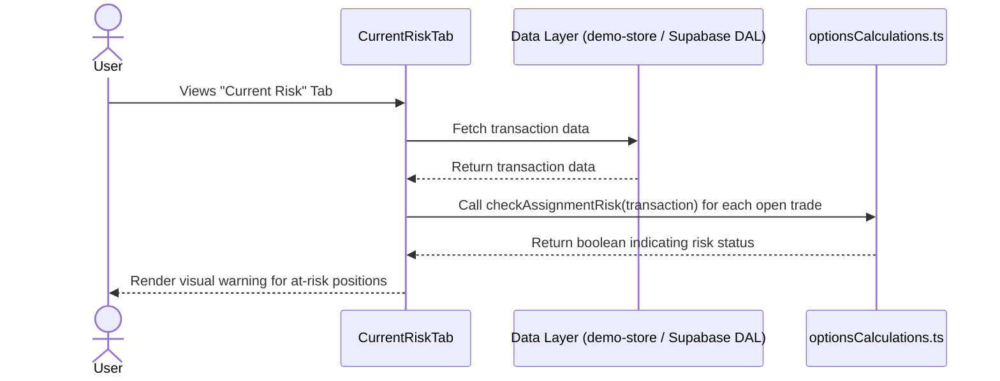

# Feature Ticket: Assignment Risk Warning

## Status
pending-implementation

## Context
Options traders face significant risk when selling options (short positions), specifically when the position is nearing expiration and is close to or in-the-money. This is called assignment risk. Currently, OptionsBookie allows users to track their open trades and capital usage, but it does not proactively highlight short trades that are dangerously close to expiration. Without this visual cue, a user might miss a critical deadline and be assigned hundreds of shares unexpectedly, disrupting their account balance and strategy.

## Objective
Provide a clear, visual warning in the "Current Risk" tab for any open short option position that is expiring within the next 7 days, allowing the user to quickly identify and manage their assignment risk.

## Scope
- In scope:
  - Add a visual indicator (e.g., a warning icon with a tooltip, or a highlighted row/section) in the `CurrentRiskTab` for open trades that meet the risk criteria.
  - The risk criteria are strictly: the transaction is a short option (e.g., Sold to Open or part of a strategy involving short legs like a Credit Spread), `status === 'Open'`, and the time to expiration (DTE) is 7 days or less.
  - Create a new pure function `checkAssignmentRisk` in `src/utils/optionsCalculations.ts` to encapsulate this logic.
- Out of scope:
  - Fetching live underlying prices to determine exact "moneyness" (we will base the warning purely on DTE for open short positions).
  - Adding new pages or altering the historical analytics views.
  - Sending push notifications or emails.

## UX & Entry Points
- Primary entry: The "Current Risk" tab (`src/components/analytics/CurrentRiskTab.tsx`).
- Components to touch:
  - `src/components/analytics/CurrentRiskTab.tsx`: Add a new section, list, or visual flag for "Positions at Risk" or simply augment the existing view to highlight these specific trades.
  - Tooltip components (`src/components/ui/tooltip.tsx`) if using an icon to explain the risk.
- UX notes: The warning should be noticeable but not overwhelming. If using a list, it could be a small "Attention Required" section at the top of the Current Risk tab displaying only the risky trades. A red or yellow alert icon from `lucide-react` is appropriate.

## Tech Plan
- Data sources / utils:
  - Existing `transactions` array passed to `CurrentRiskTab`.
  - Add `checkAssignmentRisk(transaction: Transaction, currentDate: Date): boolean` to `src/utils/optionsCalculations.ts`. This function will check if it's an open, short position with <= 7 DTE. Use existing `calculateDTE` or similar logic from `dateUtils.ts` if available, or write a simple date difference calculation.
- Files to modify / add:
  - `src/components/analytics/CurrentRiskTab.tsx` (to render the warnings).
  - `src/utils/optionsCalculations.ts` (to add `checkAssignmentRisk`).
  - `src/utils/optionsCalculations.test.ts` (to add tests for the new utility).
- Risks / constraints:
  - The calculation must remain a pure function in `src/utils/` to adhere to the Thick Client architecture.
  - Date comparisons must be robust against timezone issues (e.g., comparing local dates to UTC expiration dates).

## Sequence Diagram (High-Level)

## Acceptance Criteria
- [ ] In the "Current Risk" tab, there is a clear visual warning for open short positions expiring in 7 days or less.
- [ ] Open long positions (bought options) do NOT show this warning, even if expiring soon, as assignment risk primarily affects short positions.
- [ ] Positions expiring in more than 7 days do NOT show the warning.
- [ ] The `checkAssignmentRisk` function is thoroughly tested with unit tests in `src/utils/optionsCalculations.test.ts`.
- [ ] The feature works coherently with the mock data in the `/demo` sandbox.
