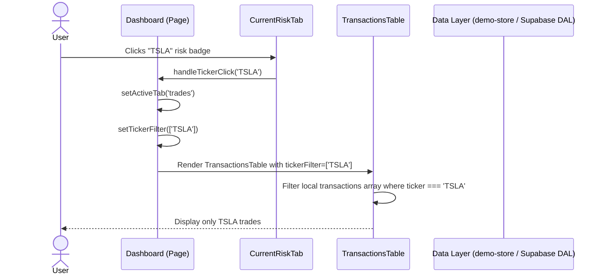

# Feature Ticket: Ticker Filter & Deep Linking in Transactions Table

## Status
pending-implementation

## Context
In a previous update to the "Current Risk" tab, we added clickable badges for at-risk tickers (e.g., AAPL, TSLA). However, clicking a badge currently only navigates the user to the "Transactions" tab and ensures "Open" trades are visible. The user is still forced to manually scan a mixed list of all their open trades to find the specific ticker they just clicked. This is because the `TransactionsTable` lacks a dedicated ticker filter and the ability to accept a pre-selected ticker via props or context.

## Objective
Add a "Ticker Filter" dropdown or multi-select to the `TransactionsTable` so users can manually filter their trades by underlying asset. Additionally, enable "deep linking" from other components (like the `CurrentRiskTab`) by allowing the `TransactionsTable` (or its parent) to accept an initial or programmatic ticker selection, instantly filtering the view when a user clicks a ticker badge elsewhere in the app.

## Scope
- In scope:
  - Add a new state variable (e.g., `selectedTickers: string[]`) to manage ticker filtering in the `TransactionsTable` (or its parent, if state is lifted up).
  - Add a UI element (e.g., a dropdown, combobox, or multi-select utilizing Shadcn UI components) above the table to allow users to select one or more tickers from the available unique tickers in their transaction history.
  - Update the existing filtering logic inside the table to include the new `selectedTickers` array alongside existing filters (like `selectedStatuses`).
  - Modify the interaction from the `CurrentRiskTab` (e.g., `handleTickerClickFromRisk`) to pass the clicked ticker down to the `TransactionsTable` so it automatically applies the filter upon navigation.
- Out of scope:
  - Complex advanced filtering (e.g., filtering by DTE ranges, specific strike prices, or option type).
  - Server-side filtering or database queries. All filtering must remain client-side (Thick Client architecture).
  - Modifying the underlying data models or Supabase tables.

## UX & Entry Points
- Primary entry: The "Options Trades" (Transactions) tab.
- Components to touch:
  - `src/components/analytics/TransactionsTable.tsx`: Add the filter UI and internal filtering logic.
  - `src/app/page.tsx` (or the equivalent main dashboard component managing tab state): Lift state up or pass a function to allow the `CurrentRiskTab` to set the active ticker filter in the `TransactionsTable`.
  - `src/components/analytics/CurrentRiskTab.tsx`: Update `handleTickerClickFromRisk` to utilize the new filter-setting mechanism.
- UX notes: The new ticker filter should sit alongside the existing status filters above the table. It should ideally be a searchable dropdown if the list of unique tickers is long, but a simple multi-select or toggle group is acceptable for V1. When a user arrives at the Transactions tab by clicking a badge in the Risk tab, the ticker filter should be visibly active.

## Tech Plan
- Data sources / utils:
  - The existing `transactions` array passed to the table.
  - Extract a unique, sorted list of tickers from the `transactions` array to populate the filter dropdown options.
- Files to modify / add:
  - `src/components/analytics/TransactionsTable.tsx`: Implement `selectedTickers` state (or accept via props), the filter UI, and apply the filter before rendering the table rows.
  - `src/app/page.tsx` (or similar parent): If `selectedTickers` needs to be controlled by the parent (to handle cross-tab clicks), move the state here and pass it down as props (`selectedTickers`, `setSelectedTickers`) to the `TransactionsTable`.
  - `src/components/analytics/CurrentRiskTab.tsx`: Update the click handler to call `setSelectedTickers([ticker])` in addition to changing the active tab.
- Risks / constraints:
  - Managing state across tabs. The cleanest approach is likely lifting the ticker filter state up to the common parent that renders both tabs, or utilizing a simple React context if the component tree is deep.
  - Ensure the filter resets gracefully (e.g., a "Clear Filters" button or an "All" option).

## Sequence Diagram (High-Level)

## Acceptance Criteria
- [ ] Users can manually filter the `TransactionsTable` by selecting one or more tickers from a dropdown or UI control.
- [ ] Clicking a ticker badge in the `CurrentRiskTab` successfully navigates the user to the Transactions tab AND automatically filters the table to show ONLY that specific ticker.
- [ ] The ticker filter options dynamically populate based on the unique tickers present in the user's data.
- [ ] The filter works conjunctively with existing filters (e.g., filtering for "TSLA" AND status "Open").
- [ ] The feature works seamlessly with the mock data in the `/demo` sandbox without requiring server-side changes.
