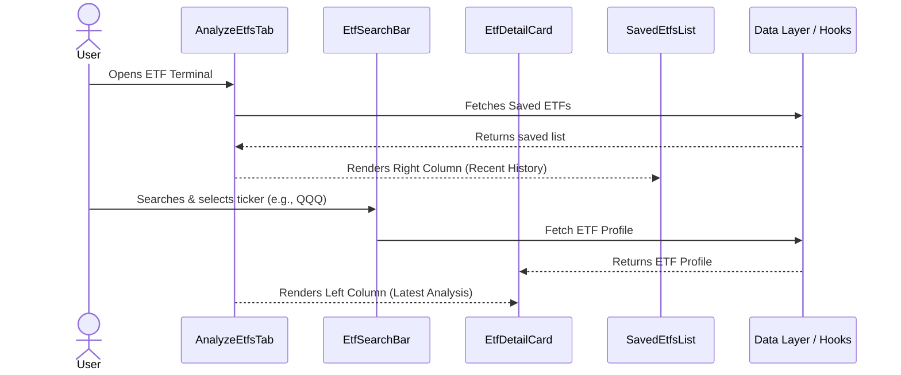

# Feature Ticket: ETF Intelligence Terminal UI Refresh

## Status
pending-implementation

## Context
Currently, the OptionsBookie ETF analysis feature (Analyze ETFs Tab) uses a simple, single-column vertical layout where search results, the active ETF profile, and saved ETFs are stacked. Options traders often monitor multiple sector or thematic ETFs simultaneously and require a denser, "terminal-like" view to quickly compare the active analysis against their watchlist of saved ETFs.

## Objective
Redesign the `AnalyzeEtfsTab` to match a professional "ETF Intelligence Terminal" two-column layout, allowing users to view their active deep-dive analysis side-by-side with their recently saved watchlist (complete with compact holdings lists).

## Scope
- In scope:
  - Add a new page header ("ETF Intelligence Terminal").
  - Refactor `AnalyzeEtfsTab.tsx` into a two-column desktop layout (e.g., Left: "LATEST ANALYSIS", Right: "RECENT HISTORY / SAVED").
  - Update `EtfDetailCard.tsx` to fit seamlessly into the left column with polished terminal-style headers and stat grids.
  - Enhance `SavedEtfsList.tsx` (or create a new component) to display saved ETFs in a vertical list, expanding their cards to show their top 10 constituents/holdings alongside the basic stats.
- Out of scope:
  - Backend database schema changes.
  - Changes to data fetching logic or API integrations.
  - Adding new metrics not already available in the `EtfProfile` or `SavedEtf` interfaces.

## UX & Entry Points
- Primary entry: The "Analyze ETFs" tab in the main application/dashboard.
- Components to touch:
  - `src/components/analytics/AnalyzeEtfsTab.tsx` (Layout refactoring)
  - `src/components/analytics/EtfDetailCard.tsx` (Styling adjustments)
  - `src/components/analytics/SavedEtfsList.tsx` (Card density and holdings display)
- UX notes: The design should use Shadcn/Tailwind for a dense, professional data terminal look. On desktop, the active search and detailed profile take the larger left column, while the right column acts as a sticky or scrollable list of saved ETFs.

## Tech Plan
- Data sources / utils: No new data sources needed. Rely entirely on the existing `useEtfSearch`, `useEtfProfile`, and `useSavedEtfs` hooks.
- Files to modify / add:
  - `src/components/analytics/AnalyzeEtfsTab.tsx`: Refactor outer wrapper to a flex or grid layout (`lg:grid-cols-12` where left is 8 cols, right is 4 cols).
  - `src/components/analytics/EtfDetailCard.tsx`: Tweak padding, borders, and typography for the terminal aesthetic.
  - `src/components/analytics/SavedEtfsList.tsx`: Update the render loop to fetch or display top holdings if available, or just restructure the existing data into a more detailed list view rather than a simple 2-column grid. *Note: `SavedEtf` currently doesn't fetch holdings. If `savedEtfs` doesn't have holdings in the UI state, it may require either fetching profiles for saved ETFs or adapting the design to show the data we have.*
- Risks / constraints: The `SavedEtf` type currently does not include `topHoldings`. The implementation might need to rely on cached `EtfProfile` data for saved items or fall back gracefully if holdings aren't loaded for the right column without causing N+1 fetching issues.

## Sequence Diagram (High-Level)

## Acceptance Criteria
- [ ] The "Analyze ETFs" tab features a new header: "ETF Intelligence Terminal".
- [ ] On desktop screens, the layout is split into two columns (Left: Active Search/Analysis, Right: Saved/History).
- [ ] The Saved ETFs list displays as a vertical column of cards, providing a denser view of stats.
- [ ] Existing functionality (searching, saving, and removing ETFs) remains fully intact.
- [ ] The design gracefully degrades to a single column on mobile devices.
- [ ] Layout matches existing OptionsBookie Tailwind styling and Shadcn UI conventions.