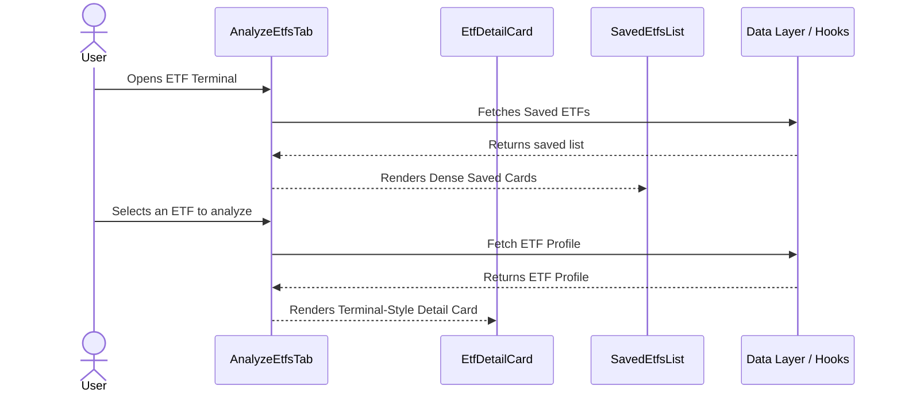

# Feature Ticket: ETF Terminal Cards UI Refresh

## Status
done

## Context
Currently, the OptionsBookie ETF analysis feature uses a straightforward visual style for its components. Options traders require a denser, "terminal-like" view to quickly parse detailed stats and constituents for ETFs. The goal is to modernize the individual component cards without altering the outer page layout.

## Objective
Redesign the `EtfDetailCard` and the cards within `SavedEtfsList` to match a professional, dense "ETF Intelligence Terminal" aesthetic. The focus is strictly on refining the internal layout of these cards to present information (such as stats grids and top holdings) more compactly and cleanly.

## Scope
- In scope:
  - Update `EtfDetailCard.tsx` to use a denser, terminal-style layout for its headers, stats grids, and sector/holdings tables.
  - Refine the cards within `SavedEtfsList.tsx` to match this denser terminal aesthetic, improving how stats are displayed.
  - Adjust internal spacing, typography, and borders of the cards to match the target terminal UI.
- Out of scope:
  - Changing the page heading or the outer macro-layout of `AnalyzeEtfsTab`.
  - Backend database schema changes.
  - Changes to data fetching logic or API integrations.
  - Adding new metrics not already available in the `EtfProfile` or `SavedEtf` interfaces.

## UX & Entry Points
- Primary entry: The cards displayed inside the "Analyze ETFs" tab.
- Components to touch:
  - `src/components/analytics/EtfDetailCard.tsx` (Styling and layout adjustments)
  - `src/components/analytics/SavedEtfsList.tsx` (Card density and layout adjustments)
- UX notes: The design should use Shadcn/Tailwind for a dense, professional data terminal look. Focus on how the data is organized *within* the cards, ensuring stats and lists are highly legible but compact.

## Tech Plan
- Data sources / utils: No new data sources needed. Rely entirely on the existing `useEtfProfile` and `useSavedEtfs` hooks.
- Files to modify / add:
  - `src/components/analytics/EtfDetailCard.tsx`: Tweak padding, borders, typography, and grid arrangements for the terminal aesthetic.
  - `src/components/analytics/SavedEtfsList.tsx`: Restructure the existing card data into a more detailed, denser view.
- Risks / constraints: Maintain responsiveness. The cards must still degrade gracefully on mobile devices despite the increased density on desktop.

## Sequence Diagram (High-Level)

## Acceptance Criteria
- [ ] `EtfDetailCard` features a denser, modernized "terminal" layout for its stats and tables.
- [ ] The cards in `SavedEtfsList` are updated to match the denser styling of the detail card.
- [ ] The outer layout and page heading of `AnalyzeEtfsTab` remain unchanged.
- [ ] The design gracefully degrades to appropriate spacing on mobile devices.
- [ ] Layout matches existing OptionsBookie Tailwind styling and Shadcn UI conventions.