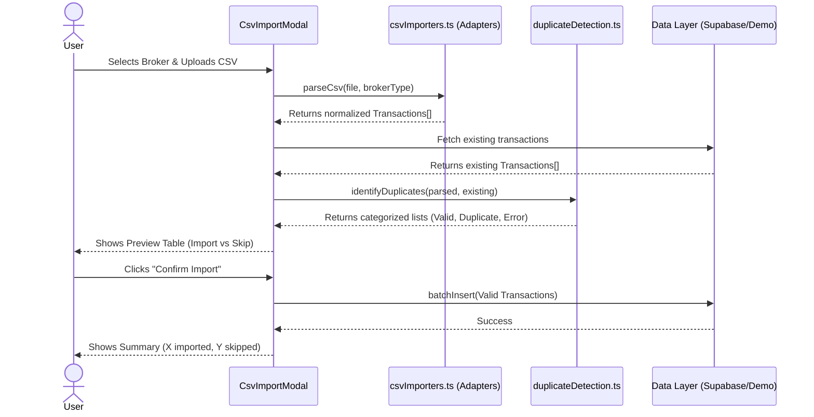

# Feature Ticket: Broker CSV Data Import

## Status
pending-implementation

## Context
Currently, users must manually enter every options transaction into OptionsBookie. This is tedious, error-prone, and a major barrier to adoption for traders who execute many trades. Traders need a way to seamlessly import their transaction history directly from their brokerages (like Schwab, Robinhood, or Moomoo) into the app without having to re-key data.

## Objective
Provide a robust "CSV Import" feature that allows users to upload exported transaction files from their brokers. The system must parse the broker-specific formats, map them to the existing `OptionsTransaction` model, prevent duplicates (especially against manually entered trades), and allow users to preview and confirm the import before saving.

## Scope
- In scope:
  - Create a unified drag-and-drop CSV upload UI.
  - Implement a broker selection dropdown (e.g., "Schwab", "Robinhood", "Moomoo").
  - Create an extensible adapter architecture in `src/utils/` (e.g., `parseSchwabCsv()`, `parseRobinhoodCsv()`) to normalize disparate broker CSV formats into the internal `OptionsTransaction` model.
  - Parse options-specific fields: symbol, trade date, expiration, strike, call/put, buy/sell, contracts, premium, fees, and lifecycle events (assignments, expirations, exercises).
  - Implement a robust duplicate detection system (e.g., matching by symbol, trade date, type, and strike) to skip transactions that already exist (including manually entered ones).
  - Provide a "Preview" step showing parsed trades, validation errors, and skipped duplicates before finalizing the import.
  - Show a post-import summary (e.g., X imported, Y skipped, Z unsupported).
- Out of scope:
  - Direct API integrations (OAuth) with brokers.
  - Server-side parsing or storage of the CSV file itself (parsing must happen client-side).
  - Importing stock/equity transactions (focus strictly on options).

## UX & Entry Points
- Primary entry: The "Options Trades" (Transactions) tab or a dedicated "Import" page/modal.
- Components to touch:
  - Add an "Import CSV" button near the "Add Trade" button.
  - Create a new `CsvImportModal.tsx` or `CsvImportWizard.tsx` (handling the multi-step flow: Select Broker & Upload -> Preview -> Summary).
- UX notes:
  - The wizard should be clear: Step 1: Choose broker & upload file. Step 2: Review parsed data in a table format, highlighting any rows that will be skipped due to duplication. Step 3: Confirm and import.
  - Clear messaging should explain that manual entries are protected and duplicate imports are safely ignored.

## Tech Plan
- Data sources / utils:
  - Create a new directory `src/utils/csv-adapters/` (or similar) containing the modular parsers.
  - The parsers will likely need a CSV parsing library (e.g., `papaparse` if already installed, or simple manual parsing for V1) to convert raw text to objects.
  - Update `src/lib/database-supabase.ts` or `demo-store.ts` to handle batch insertions if not already present.
- Files to modify / add:
  - `src/components/analytics/CsvImportModal.tsx` (new UI wizard).
  - `src/utils/csvImporters.ts` (new registry/coordinator for adapters).
  - `src/utils/csv-adapters/schwab.ts`, `robinhood.ts`, `moomoo.ts` (new adapters).
  - `src/utils/duplicateDetection.ts` (new utility to hash/compare trades to prevent duplicates).
- Risks / constraints:
  - Client-side performance when parsing large CSV files (e.g., thousands of rows).
  - Broker CSV formats change without warning; the adapters must handle missing columns or unexpected data gracefully without crashing the app.
  - Duplicate detection must be carefully calibrated to avoid false positives (e.g., two identical trades placed on the same day) or false negatives.

## Sequence Diagram (High-Level)

## Acceptance Criteria
- [ ] Users can select a broker (Schwab, Robinhood, Moomoo) and upload a CSV file.
- [ ] The system accurately parses options-specific fields (strike, expiry, type, premium, fees) into the `OptionsTransaction` format.
- [ ] Before saving, the user sees a preview table showing the parsed trades.
- [ ] The system correctly identifies and flags duplicates against existing trades (whether manually entered or previously imported).
- [ ] Confirmed valid trades are saved to the database and immediately appear in the Transactions table.
- [ ] The CSV parsing logic is modular, allowing new brokers to be easily added in the future.
- [ ] Unit tests cover the specific parsing logic for each implemented broker adapter.
