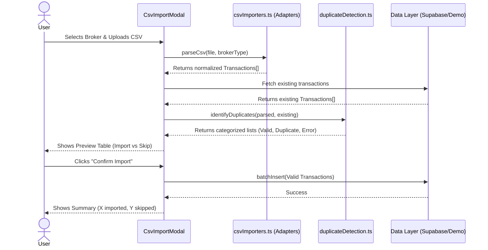

# Feature Ticket: Broker CSV Data Import

## Status
pending-implementation

## Context
Currently, users must manually enter every options transaction into OptionsBookie. This is tedious, error-prone, and a major barrier to adoption for traders who execute many trades. Traders need a way to seamlessly import their transaction history directly from their brokerages (like Schwab, Robinhood, or Moomoo) into the app without having to re-key data.

## Objective
Provide a robust "CSV Import" feature that allows users to upload exported transaction files from their brokers. The system must parse the broker-specific formats, map them to the existing `OptionsTransaction` model, prevent duplicates (especially against manually entered trades), and allow users to preview and confirm the import before saving.

## Scope
- In scope:
  - Create a unified drag-and-drop CSV upload UI.
  - Implement a broker selection dropdown (e.g., "Schwab", "Robinhood", "Moomoo").
  - Create an extensible adapter architecture in `src/utils/` (e.g., `parseSchwabCsv()`, `parseRobinhoodCsv()`) to normalize disparate broker CSV formats into the internal `OptionsTransaction` model.
  - Parse options-specific fields: symbol, trade date, expiration, strike, call/put, buy/sell, contracts, premium, fees, and lifecycle events (assignments, expirations, exercises).
  - Implement a robust duplicate detection system (e.g., matching by symbol, trade date, type, and strike) to skip transactions that already exist (including manually entered ones).
  - Provide a "Preview" step showing parsed trades, validation errors, and skipped duplicates before finalizing the import.
  - Show a post-import summary (e.g., X imported, Y skipped, Z unsupported).
- Out of scope:
  - Direct API integrations (OAuth) with brokers.
  - Server-side parsing or storage of the CSV file itself (parsing must happen client-side).
  - Importing stock/equity transactions (focus strictly on options).

## UX & Entry Points
- Primary entry: The "Options Trades" (Transactions) tab or a dedicated "Import" page/modal.
- Components to touch:
  - Add an "Import CSV" button near the "Add Trade" button.
  - Create a new `CsvImportModal.tsx` or `CsvImportWizard.tsx` (handling the multi-step flow: Select Broker & Upload -> Preview -> Summary).
- UX notes:
  - The wizard should be clear: Step 1: Choose broker & upload file. Step 2: Review parsed data in a table format, highlighting any rows that will be skipped due to duplication. Step 3: Confirm and import.
  - Clear messaging should explain that manual entries are protected and duplicate imports are safely ignored.

## Tech Plan
- Data sources / utils:
  - Create a new directory `src/utils/csv-adapters/` (or similar) containing the modular parsers.
  - The parsers will likely need a CSV parsing library (e.g., `papaparse` if already installed, or simple manual parsing for V1) to convert raw text to objects.
  - Update `src/lib/database-supabase.ts` or `demo-store.ts` to handle batch insertions if not already present.
- Files to modify / add:
  - `src/components/analytics/CsvImportModal.tsx` (new UI wizard).
  - `src/utils/csvImporters.ts` (new registry/coordinator for adapters).
  - `src/utils/csv-adapters/schwab.ts`, `robinhood.ts`, `moomoo.ts` (new adapters).
  - `src/utils/duplicateDetection.ts` (new utility to hash/compare trades to prevent duplicates).
- Risks / constraints:
  - Client-side performance when parsing large CSV files (e.g., thousands of rows).
  - Broker CSV formats change without warning; the adapters must handle missing columns or unexpected data gracefully without crashing the app.
  - Duplicate detection must be carefully calibrated to avoid false positives (e.g., two identical trades placed on the same day) or false negatives.

## Sequence Diagram (High-Level)

## Acceptance Criteria
- [ ] Users can select a broker (Schwab, Robinhood, Moomoo) and upload a CSV file.
- [ ] The system accurately parses options-specific fields (strike, expiry, type, premium, fees) into the `OptionsTransaction` format.
- [ ] Before saving, the user sees a preview table showing the parsed trades.
- [ ] The system correctly identifies and flags duplicates against existing trades (whether manually entered or previously imported).
- [ ] Confirmed valid trades are saved to the database and immediately appear in the Transactions table.
- [ ] The CSV parsing logic is modular, allowing new brokers to be easily added in the future.
- [ ] Unit tests cover the specific parsing logic for each implemented broker adapter.

Broker CSV Import: Architectural Blueprint & Strategy
Integrating broker CSV imports into a system that already supports manual entries is notoriously complex, especially for options trading. Combining my options trader intuition with a robust React/Next.js architectural mindset, here is the deep-dive analysis of the edge cases and a safe, iterative roadmap to the North Star.

🎩 The Options Trader's Edge Cases
When merging manual bookkeeping with broker-generated CSVs, we hit several nasty realities of how brokers export options data:

The Partial Fill Nightmare: You manually log a trade as "Bought 10 SOXX Calls at $5.00". Your broker CSV might export this as 3 separate rows executed milliseconds apart: 3 contracts @ $4.95, 5 contracts @ $5.00, 2 contracts @ $5.05. A naive deduplicator will import all 3 rows because none of them exactly match your manual entry of "10 @ $5.00".
The "Roll" Disconnect: Brokers do not understand "Rolls" as a single metaphysical trade. They just see a "Sell to Close" of one strike and a "Buy to Open" of another. If the user manually tracked a chain, the imported rows will dump in as isolated legs.
Ghost Expirations & Assignments: When an option expires worthless, some brokers generate a dummy transaction with $0 premium. Others just delete the asset. If assigned, they might spawn a massive stock transaction without explicitly linking it to the option's demise.
Time & Date Skew: You might manually log a trade on 2026-04-20. The broker might log it on 2026-04-21 if it settled after hours, or due to timezone differences (EST vs Local).
WARNING

Without handling these edge cases, users will end up with corrupted "hybrid" chains where a manually opened trade remains "Open" forever because the broker's "Sell to Close" leg was imported as a standalone trade.

⚛️ The UX/UI Vision (Frictionless Reconciliation)
To handle the complexity of hybrid manual/uploaded data, we should use a "Reconciliation Wizard" pattern rather than a simple "Upload & Done" button. We need to build trust.

The UI Flow
The Drop zone: A clear modal to drop the CSV and select the Broker format.
The Reconciliation Table (The Magic Step): Instead of just importing blindly, the UI presents a data table with color-coded row states:
🟢 New Trade: Clean, unrecognized trade. Safe to import.
🟡 Linked to Open: "This 'Sell to Close' matches your manually entered 'Buy to Open' from last week."
🟠 Probable Duplicate / Partial Fill: "We found 3 lines that equal your 1 manual entry. We recommend skipping these."
🔴 Duplicate: "Exact match found. Skipping automatically."
User Overrides: Checkboxes next to every row allowing the user to override the system's guess before hitting the final "Confirm Import" button.
🧭 The Iterative Implementation Plan
To avoid boiling the ocean, we will build this in 4 distinct phases. This ensures structural integrity at each step.

Phase 1: The Isolated Parsers (Data Normalization)
Goal: Build the engine that converts chaotic broker CSVs into our pristine OptionsTransaction interface. No databases, no UI matching yet.

Set up src/utils/csv-adapters/ with interfaces (e.g., BrokerAdapter).
Integrate a robust parser like papaparse (client-side only).
Implement the first broker (e.g., Schwab). Give it hardcoded unit tests for parsing complex strings like "SOXX 01/21/2028 350.00 C".
Deliverable: A utility function parseBrokerCSV(file, 'schwab') that returns OptionsTransaction[].
Phase 2: The Confidence Deduplication Engine
Goal: Create a standalone utility that takes an array of "Incoming Items" and an array of "Existing DB Items" and spits out a categorized map.

Build strict matching (exact Date, Symbol, Strike, Type, Quantity).
Build fuzzy matching for partial fills (e.g., group incoming rows by Date + Symbol + Strike, sum their quantities and average their premiums, then compare against the manual DB entries).
Establish the "Confidence Score" interface for the UI to consume.
Deliverable: A highly tested analyzeImport(incoming, existing) pure function.
Phase 3: The Reconciliation UI & DB Integration
Goal: Hook Phase 1 & 2 up to the user interface.

Build the CsvImportWizard.tsx component.
Ensure the UI elegantly renders the Confidence Engine's results (Green/Yellow/Orange/Red row highlighting).
Hook up the "Confirm" button to supabase.ts or demo-store.ts via a batch insert method.
Deliverable: A fully functioning end-to-end import feature for basic trades.
Phase 4: Chain Auto-Stitching (The North Star)
Goal: Solve the manual/imported hybrid chain problem.

Up until Phase 3, an imported closing leg will just sit as a "standalone" transaction.
In Phase 4, we introduce logic that scans new imported trades upon insertion. If it finds a "Sell to Close" LEAP, it hunts for an active "Buy to Open" LEAP in the DB with the same strike/expiry.
It auto-assigns the imported leg the chainId of the manual leg, beautifully tying the manual open and the broker close into a single logical chain.
Deliverable: Flawless options lifecycle tracking regardless of whether the trade was typed by hand or uploaded by file.
Open Questions for You
Which broker should we build the first adapter for? We need a concrete CSV file template to write the first parser unit tests correctly.
Partial Fills Policy: If we detect a partial fill mapping (3 broker rows that equal 1 manual entry), should we default the UI to Skip the broker rows and keep the manual row, or Delete the manual row and import the true broker rows?

