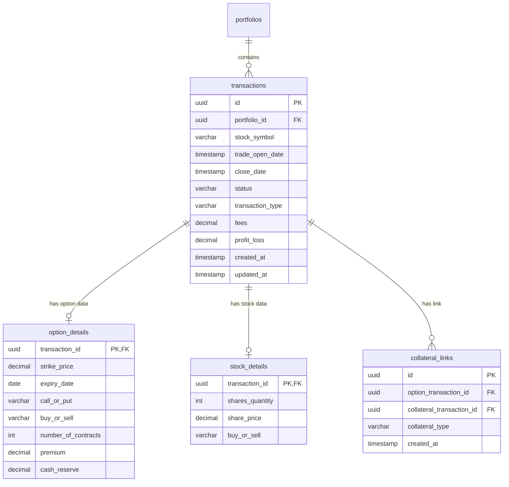

# Feature Ticket: Database Schema Normalization (Parent-Child Ledger)

## Status
pending-implementation

## Context
With the introduction of Stock Holdings tracking and transaction-to-transaction linkage (e.g., covered calls linked to stock lots), the legacy flat `options_transactions` table is suffering from severe column sparsity. Option-specific fields (like `strike_price`, `expiry_date`, `call_or_put`) are null for stock trades, and stock-specific fields (like `shares_quantity`, `share_price`) are null for option contracts.

Managing all data in a single sparse table limits the scalability of the application and increases structural risk when adding future asset classes or complex strategies (e.g., spreads, cash-secured puts with margin offsets, or futures).

## Objective
Normalize the database schema into a parent-child ledger architecture. Define a base `transactions` table containing core ledger fields, separate child tables for option/stock metadata, and a distinct table for tracking collateral linkage.

To minimize disruption, this refactoring will follow a **progressive migration strategy** using a database view compatibility adapter, allowing the frontend UI components and calculation modules to remain unchanged in Phase 1.

## Scope
- **In scope**:
  - Designing and creating the new normalized tables (`transactions`, `option_details`, `stock_details`, `collateral_links`) in Supabase.
  - Setting up tenant-isolated Row-Level Security (RLS) policies for all four new tables.
  - Creating a Postgres SQL data migration block to map existing `options_transactions` data to the new tables without loss of historical context.
  - Implementing a Postgres View `v_options_transactions` that performs a `LEFT JOIN` on the new tables and exposes the exact schema shape of the legacy table.
  - Defining `INSTEAD OF` triggers on the view to handle insert, update, and delete operations, providing full database-level backward compatibility.
  - Retiring the unused SQLite wrapper file (`src/lib/database.ts`).
  - Adapting the in-memory Demo Store (`src/lib/demo-store.ts`) to manage the normalized structure internally while exposing a flat DTO interface to the client.
- **Out of scope**:
  - Immediately refactoring the React components, modals, and tables to consume distinct options and stock entities (defer to Phase 2).
  - Rewriting the frontend typescript types or client-side calculation utility functions.

## Architecture Map

## Tech Plan
1. **Supabase Schema Update**: Write a migration SQL script creating the tables, indexes, and triggers. Enable RLS and define policies restricting reads/writes based on portfolio owner or user email matches.
2. **Postgres View and Trigger Setup**: Create the `v_options_transactions` view and write plpgsql functions for handling inserts, updates, and deletes directly against the view.
3. **Data Migration Block**: Run an insert transaction block mapping all legacy rows. Ensure that `covered_by_id` mappings translate correctly to `collateral_links` entries.
4. **Data Access Layer Integration**: Point the live API adapters (`src/lib/database-secure.ts`) to read and write from `v_options_transactions` instead of `options_transactions`.
5. **Demo State Restructuring**: Refactor `src/lib/demo-store.ts` to internally store records split into normalized arrays (`transactions`, `optionDetails`, `stockDetails`, `collateralLinks`) so that Demo Mode accurately simulates database behavior.
6. **SQLite Deprecation**: Delete `src/lib/database.ts` and its associated unit test files.

## Acceptance Criteria
- [ ] Database schema is successfully deployed with RLS enabled on all normalized tables.
- [ ] Complete data migration of existing live accounts is executed without any records lost or P&L mismatches.
- [ ] Database-level CRUD requests against the compatibility view `v_options_transactions` succeed.
- [ ] All existing Jest tests pass successfully, confirming no breaking changes were introduced to calculation engines or API routes.
- [ ] The unused file `src/lib/database.ts` and its unit tests are deleted from the codebase.
- [ ] Demo Mode operates seamlessly, executing CRUD operations and calculations correctly.
