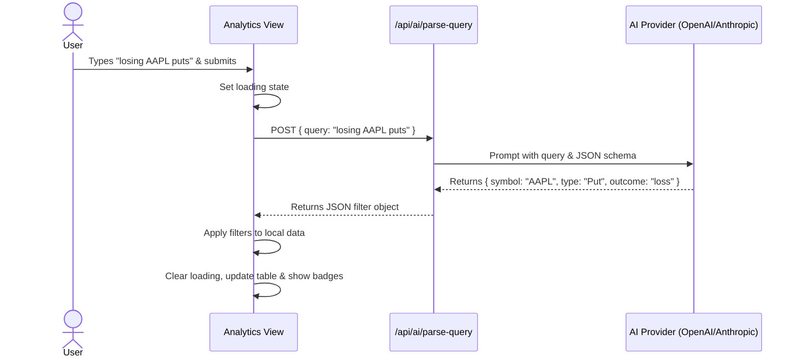

## Status
pending-clarification

## Context
Traders currently rely on manual dropdowns and input fields to filter their trade history. When analyzing past performance, they often have specific, nuanced questions in mind (e.g., "Show me all losing puts on AAPL this year" or "What were my winning iron condors last month?"). Translating these questions into manual UI filters is cumbersome and slows down post-trade analysis.

## Objective
Introduce an "AI Filter" feature that allows users to type natural language queries to filter their trade history. An LLM will parse the user's intent into structured filter parameters, which are then applied to the existing analytics tables automatically.

## Scope
- Add an "Ask AI to filter..." text input above the `TransactionsTable` in the Analytics view.
- Create a lightweight client-to-AI utility (e.g., a Next.js API route using the Vercel AI SDK or a direct fetch to an LLM provider) to translate the natural language string into a defined JSON filter schema (e.g., `{ symbol?: string, type?: string, outcome?: 'win' | 'loss', timeframe?: string }`).
- Apply the generated filter object to the local in-memory dataset before rendering the table.
- Ensure graceful degradation: if the AI service is unavailable or fails to parse the query, the UI should gracefully fallback and allow standard manual filtering.

## UX & Entry Points
- **Entry Point:** A new search bar with a "Sparkles" (AI) icon located above the `TransactionsTable` in `src/components/analytics/`.
- **Interaction:** User types a query and hits Enter. A loading state (spinner/skeleton) is shown while the LLM parses the request.
- **Feedback:** Once parsed, the UI displays active filter badges (e.g., "Symbol: AAPL", "Outcome: Loss") so the user understands how the AI interpreted their query.
- **Reset:** A "Clear AI Filters" button quickly reverts the view to the unfiltered state.

## Tech Plan
1. **Define Filter Schema:** Create a TypeScript interface for the parsed filter parameters in `src/types/options.ts` or a relevant types file.
2. **API Route:** Add an endpoint `src/app/api/ai/parse-query/route.ts` that accepts the user's string and uses an LLM (via Vercel AI SDK's `generateObject` or similar) to return the structured JSON filter.
3. **UI Integration:**
   - Update `TransactionsTable` (or its parent wrapper) to include the new AI search input.
   - Add state for `aiFilters`, `isAILoading`, and `aiError`.
4. **Data Filtering logic:** Extend the existing client-side filtering logic to incorporate the `aiFilters` fields (matching symbol, type, win/loss status derived from P&L, etc.).

## Sequence Diagram

## Acceptance Criteria
- [ ] Users can enter a natural language query in a new input field above the analytics transactions table.
- [ ] The system accurately parses intent into a structured filter (handling symbols, trade types, and win/loss states).
- [ ] The table dynamically updates to show only the trades matching the AI-generated filters.
- [ ] The UI displays a clear loading indicator during the AI request.
- [ ] Active AI filters are visibly indicated to the user, with an option to clear them.
- [ ] If the AI request fails, an unobtrusive error message is shown and the table remains unaffected.

## Questions from Atlas
- Q1: The tech plan mentions using Vercel AI SDK or similar, but the project prefers using the Gemini API via the `@google/genai` package for AI feature implementations. Moreover, Atlas is prohibited from adding new dependencies to `package.json` without explicit instruction. Should I add `@google/genai` to `package.json`, or should I use an existing library/fetch directly from a REST endpoint instead?