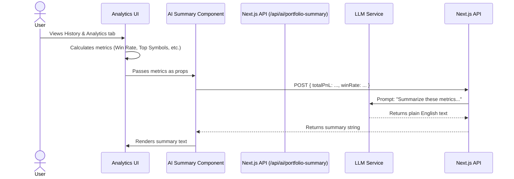

## Status
done

## Context
Traders reviewing their History & Analytics tab currently see raw charts and metrics (like win rate, RoC, and P&L). While useful, these require mental effort to interpret. Providing a plain-English narrative summary of their performance would make the analytics more digestible and accessible, quickly surfacing the 'story' behind the numbers without making the trader hunt through charts.

## Objective
Introduce an "AI Summary" feature that generates a brief, natural language summary of the user's portfolio performance over a selected timeframe (e.g., "Your win rate improved this week, largely driven by successful Iron Condors on tech stocks. However, your SPY put spreads dragged down overall P&L.").

## Scope
- Add a new `AIPortfolioSummary` component at the top of the History & Analytics view (or within the `YearPortfolioAnalytics` / `MonthPortfolioAnalytics` sections).
- Create a Next.js API route (`/api/ai/portfolio-summary`) that accepts aggregated high-level metrics (e.g., total P&L, win rate, top winning/losing symbols, total RoC) and uses an LLM (via Vercel AI SDK or similar) to generate a 2-3 sentence paragraph.
- Ensure graceful degradation: if the AI service fails or is unavailable, the component should safely hide itself or show a subtle error state, without breaking the rest of the analytics view.
- Leverage only existing client-side calculated metrics—no new database queries or data pipelines should be added.

## UX & Entry Points
- **Location:** A new "AI Summary" card (perhaps with a Sparkles ✨ icon) displayed prominently in the Analytics view.
- **Interaction:** Automatically generated on load (or triggered via a "Generate Summary" button) using the currently filtered timeframe and metrics.
- **Feedback:** Displays a loading skeleton while generating, and gracefully falls back on error.

## Tech Plan
1. **Component Creation:** Build `AIPortfolioSummary.tsx` in `src/components/analytics/` that accepts props like `totalPnL`, `winRate`, `topSymbols`, etc.
2. **API Route:** Add `src/app/api/ai/portfolio-summary/route.ts` to construct a prompt from the provided metrics and call an LLM (e.g., using `openai.chat.completions.create` or `generateText` from Vercel AI SDK).
3. **Integration:** Update the main analytics layout to compute these top-level metrics from the existing `transactions` array and pass them to the new component.
4. **Resilience:** Wrap the API call in a try/catch block to ensure failure doesn't crash the page.

## Sequence Diagram

## Acceptance Criteria
- [x] A new AI Summary component is visible in the History & Analytics view.
- [x] The component sends top-level portfolio metrics to a dedicated API route.
- [x] The API route uses an LLM to generate a short, readable 2-3 sentence summary.
- [x] A loading state is clearly visible while the summary is being generated.
- [x] If the API request fails, the component degrades gracefully (hides or shows a fallback message) without affecting the rest of the app.
- [x] No new database tables or backend data pipelines are created.

## Implementation Notes
- Files changed: `src/components/SummaryView.tsx`, `src/components/analytics/AIPortfolioSummary.tsx`, `src/app/api/ai/portfolio-summary/route.ts`
- Behavior:
  - Added an AI Portfolio Summary component that displays an LLM-generated summary of the user's overall portfolio metrics.
  - Placed gracefully within the `SummaryView` on desktop and mobile, automatically invoking the API using existing metrics like total P&L, win rate, and top symbols.
  - Built an API endpoint `/api/ai/portfolio-summary` to handle both authenticated standard users via Gemini AI and unauthenticated users on the Demo site with a mock delay.
- Tests: Verified the build success and standard test suite passed. UI interactions are protected by fallback checks when API returns failures.
- Known follow-ups: The AI summary currently focuses only on the "All Time" metrics in the Summary View. Future iterations could add it to `YearlyPerformanceCard` for year-specific summaries.
