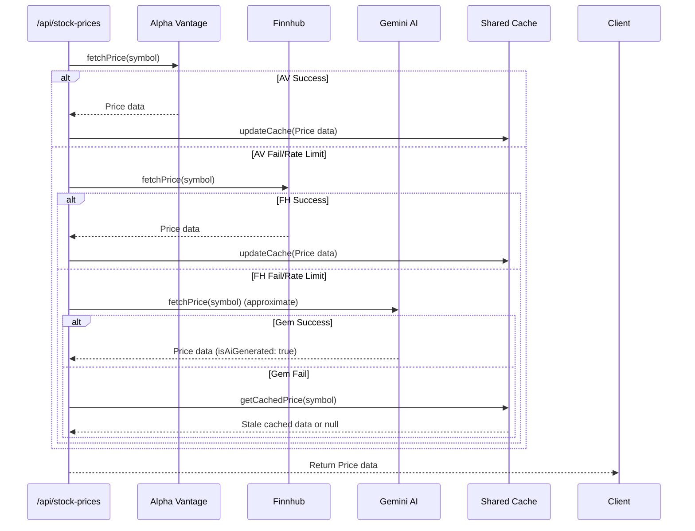

## Status
done

## Context
The application relies on deterministic market data providers (Alpha Vantage and Finnhub) to fetch current stock prices. Because these APIs use free-tier plans, rate-limiting is common. While caching mitigates some API hits, there is a risk of a "no data" state when rate limits are exhausted. We have the option to use Gemini AI as an approximate fallback provider when deterministic providers and caching fail.

Currently, the fallback logic is somewhat ad-hoc and tightly couples the `CachedStockService` with `AlphaVantageStockService`. We need to refine the fallback chain to the following precise order: Alpha Vantage -> Finnhub -> Gemini -> Cache -> None. Any data sourced from Gemini must be explicitly flagged as AI-generated approximate data so the UI can accurately convey its lower trust status. **Crucially, Gemini AI generated data must never be saved into the cache.**

## Objective
Introduce Gemini AI as a tertiary stock price provider fallback and refactor the `StockPriceService` architecture to support a clean, sequential provider fallback chain while strictly protecting the cache from approximate AI data.

## Scope
- Update `StockPriceResponse` interface to include an optional `isAiGenerated?: boolean` flag.
- Create a new `GeminiStockService` implementing `StockPriceService` that uses `@google/genai` to fetch a stock price, enforcing a strict JSON output schema.
- Refactor `StockPriceFactory` and `src/app/api/stock-prices/route.ts` to implement the exact fallback chain:
  1. Alpha Vantage
  2. Finnhub
  3. Gemini AI
  4. Cached Result (if all fresh data sources fail, retrieve the last known cached price regardless of TTL)
  5. None
- Note: Decouple the `CachedStockService` so it acts as an independent cache layer rather than directly instantiating Alpha Vantage internally.

## UX & Entry Points
- **Location:** Any UI component that displays a current stock price fetched from the backend (e.g., dashboard, open positions).
- **Interaction:** The UI logic remains the same. If the API returns `isAiGenerated: true`, the UI should append a ✨ (Sparkles) icon or a small tooltip indicating "Approximate AI Data". (UI implementation might be a separate/future PR, but the API must supply the flag).

## Tech Plan
1. **Types Update:** Update `StockPriceResponse` in `src/lib/stock-price-factory.ts` to add `isAiGenerated?: boolean`. Add `gemini` to `StockPriceProvider`.
2. **Provider Creation:** Create `src/lib/stock-price-gemini.ts` with `GeminiStockService`. It should use the Vercel AI SDK or direct `@google/genai` to prompt Gemini for a stock's current approximate price, change, and change percent, structured as JSON.
3. **Decouple Cache:** Modify `src/lib/stock-price-cached.ts` so it *only* reads/writes to the `sharedStockPriceCache` and no longer calls Alpha Vantage directly.
4. **Refactor Fallback Logic:** Update `src/app/api/stock-prices/route.ts` (or introduce a new orchestrator service) to handle the sequential fallback:
   - Try `StockPriceFactory.initialize('alphavantage')`
   - If null/fail, try `StockPriceFactory.initialize('finnhub')`
   - If null/fail, try `StockPriceFactory.initialize('gemini')`
   - If success from Alpha Vantage or Finnhub, save the result to the cache. **Do not save to cache if the success was from Gemini (`isAiGenerated: true`).**
   - If all fresh sources fail, try `StockPriceFactory.initialize('cached')` as a last resort.

## Sequence Diagram

## Acceptance Criteria
- [x] `StockPriceResponse` includes an `isAiGenerated` boolean.
- [x] A new `GeminiStockService` exists and successfully uses a GenAI provider to return a strict JSON response containing stock price info.
- [x] The fallback sequence is exactly: Alpha Vantage -> Finnhub -> Gemini -> Cache.
- [x] Gemini data correctly sets `isAiGenerated: true`.
- [x] Data retrieved from Gemini AI is never saved into the cache.
- [x] The `CachedStockService` no longer directly imports and calls `alphaVantageStockService`.

## Implementation Notes
- Files changed: `src/lib/stock-price-factory.ts`, `src/lib/stock-price-cached.ts`, `src/app/api/stock-prices/route.ts`, `src/lib/stock-price-gemini.ts`, `src/lib/stock-price-orchestrator.ts`
- Behavior: Added an AI fallback provider (using Gemini) to the stock price fetching pipeline. Decoupled fallback orchestrator logic from the core cache service, establishing a clean execution chain (Cache Check -> Alpha Vantage -> Finnhub -> Gemini AI -> Stale Cache Fallback). Successfully flags AI-generated responses while preventing them from persisting in the shared backend cache.
- Tests: Added comprehensive testing for `GeminiStockService` and the fallback logic strictly configured in `OrchestratorStockService`. Ensured backwards compatibility within the previous test suites.
- Known follow-ups: The UI layer needs an update to display the ✨ (Sparkles) icon and tooltip for prices flagged with `isAiGenerated: true`.
