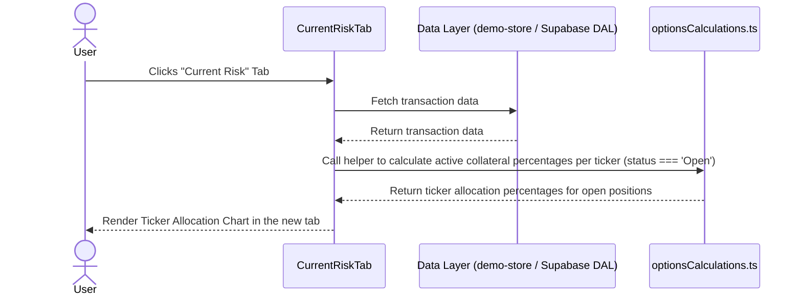

# Feature Ticket: Underlying Asset Exposure (Ticker Allocation)

## Status
pending-implementation

## Context
Options traders need to manage their risk and avoid over-concentration in a single underlying asset. Currently, OptionsBookie mixes realized historical performance with current active risk within a single "Summary and Analytics" tab. Users need a dedicated space to visualize their *current* risk profile, such as how their active capital (collateral) is distributed across open positions, to avoid outsized risk if a specific stock moves unfavorably.

## Objective
Restructure the analytics view to separate historical performance from current active risk, and provide a clear, visual breakdown of the user's *current* capital allocation across active tickers in the new active risk view.

## Scope
- In scope:
  - Rename the existing "Summary and Analytics" tab (or navigation item) to "History & Analytics".
  - Introduce a new "Current Risk" (or "Active Analytics") tab.
  - Add a visual breakdown (e.g., a simple pie chart, bar chart, or progress bar list) inside the new "Current Risk" tab showing the percentage of total capital currently at risk (`totalCollateral`) allocated to each ticker, strictly filtered for trades with `status === 'Open'`.
  - Ensure the visualization uses existing Shadcn UI / Recharts / Tailwind CSS patterns.
- Out of scope:
  - Complex risk modeling (e.g., beta weighting, Greek-based risk analysis).
  - Modifying the core transaction schema.
  - Moving existing historical analytics (like monthly breakdown or win rate) into the new tab.

## UX & Entry Points
- Primary entry: The main dashboard navigation tabs.
- Components to touch:
  - The main dashboard or layout component containing the tabs (e.g., `src/app/page.tsx`, `src/app/demo/page.tsx`, or a `Tabs` component wrapper).
  - Create a new component for the "Current Risk" tab content (e.g., `src/components/analytics/CurrentRiskTab.tsx`).
  - Create a new small component like `TickerAllocationChart.tsx` in `src/components/analytics/` for the visualization itself.
- UX notes: The new tab should feel like a dedicated dashboard for active trades. The allocation visualization should clearly show what percentage of the total active portfolio collateral is currently tied to each ticker.

## Tech Plan
- Data sources / utils:
  - We will filter the full `transactions` list down to only active, open transactions (`status === 'Open'`) before passing it to the new `CurrentRiskTab`.
  - Calculate total open `totalCollateral` across all open trades to find the denominator, then aggregate it by ticker to find the numerator.
  - We will calculate percentages for the top N active tickers by open collateral, grouping the rest into an "Other" category.
  - This open-collateral aggregation logic should be a small pure function added to `src/utils/optionsCalculations.ts` to keep the UI clean.
- Files to modify / add:
  - Main tab wrapper components (e.g., `src/app/(dashboard)/page.tsx` or similar).
  - `src/components/analytics/CurrentRiskTab.tsx` (new).
  - `src/components/analytics/TickerAllocationChart.tsx` (new).
  - `src/utils/optionsCalculations.ts` (helper function for percentage calculations).
- Risks / constraints:
  - Ensure the chart renders correctly when collateral is 0 (e.g., avoid division by zero).
  - Maintain the "Thick Client" architecture by keeping any complex data reshaping in `src/utils/` or as simple component-level pure functions, not in the data access layer.
  - Performance: The calculations must be fast since they run on the client side.

## Sequence Diagram (High-Level)

## Acceptance Criteria
- [ ] The main navigation clearly separates "History & Analytics" from the new "Current Risk" (or "Active Analytics") tab.
- [ ] Inside the "Current Risk" tab, users see a visual representation of their *current* capital allocation across underlying tickers.
- [ ] The visualization accurately calculates the percentage of total collateral for each ticker based ONLY on open trades (`status === 'Open'`).
- [ ] The visualization handles edge cases gracefully, such as when there are no open trades or total active collateral is 0.
- [ ] The UI matches existing OptionsBookie design patterns (Tailwind, Recharts).
- [ ] The feature works coherently with the mock data in the `/demo` sandbox.
