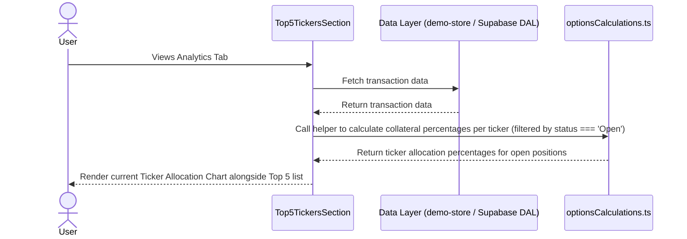

# Feature Ticket: Underlying Asset Exposure (Ticker Allocation)

## Status
pending-implementation

## Context
Options traders need to manage their risk and avoid over-concentration in a single underlying asset. Currently, OptionsBookie shows the top 5 tickers by PnL or trade count, but it lacks a clear visualization of how capital (collateral) or overall risk is distributed across different tickers. Users may not realize they have too much capital tied up in a single stock, exposing them to outsized risk if that stock moves unfavorably.

## Objective
Provide a clear, visual breakdown of the user's *current* capital allocation and risk exposure across their active tickers. The goal is to let traders see at a glance if their portfolio is currently too heavily concentrated in one or a few underlying assets based only on open positions.

## Scope
- In scope:
  - Add a small visual breakdown (e.g., a simple pie chart, bar chart, or progress bar list) showing the percentage of total capital currently at risk (`totalCollateral`) allocated to each ticker, strictly filtered for trades with `status === 'Open'`.
  - Integrate this visualization into the existing `Top5TickersSection` component or right next to it in the analytics dashboard.
  - Ensure the visualization uses existing Shadcn UI / Recharts / Tailwind CSS patterns.
  - Utilize the existing `TickerData` structure which already includes `totalCollateral`, but ensure calculations are scoped down to open trades.
- Out of scope:
  - Complex risk modeling (e.g., beta weighting, Greek-based risk analysis).
  - Adding new data fetching logic or new database queries (we must use the data already provided to the analytics view).
  - Modifying the core transaction schema.

## UX & Entry Points
- Primary entry: The "Analytics" tab, specifically within or immediately adjacent to the `Top5TickersSection`.
- Components to touch:
  - `src/components/analytics/Top5TickersSection.tsx`
  - Potentially creating a new small component like `TickerAllocationChart.tsx` in `src/components/analytics/`.
- UX notes: The visualization should be clean and not overwhelm the existing top 5 list. A small pie/donut chart using `recharts` with a legend, or a list of horizontal progress bars showing percentages, would work well. It should clearly show what percentage of the total portfolio collateral is currently tied to each top ticker.

## Tech Plan
- Data sources / utils:
  - The `yearTransactions` array is passed into `Top5TickersSection.tsx`. We must filter this down to only active, open transactions (`status === 'Open'`).
  - Calculate `totalCollateral` for these open trades across all tickers to find the denominator, then aggregate it by ticker to find the numerator.
  - We will calculate percentages for the top N tickers by open collateral, grouping the rest into an "Other" category.
  - This open-collateral aggregation logic should be a small pure function added to `src/utils/optionsCalculations.ts` to keep the UI clean.
- Files to modify / add:
  - `src/components/analytics/Top5TickersSection.tsx` (to include the new visualization).
  - `src/utils/optionsCalculations.ts` (if a helper function is needed for the percentage calculations).
- Risks / constraints:
  - Ensure the chart renders correctly when collateral is 0 (e.g., avoid division by zero).
  - Maintain the "Thick Client" architecture by keeping any complex data reshaping in `src/utils/` or as simple component-level pure functions, not in the data access layer.
  - Performance: The calculations must be fast since they run on the client side.

## Sequence Diagram (High-Level)

## Acceptance Criteria
- [ ] Users can see a visual representation (chart or bars) of their *current* capital allocation across underlying tickers in the Analytics view.
- [ ] The visualization accurately calculates the percentage of total collateral for each ticker based ONLY on open trades (`status === 'Open'`).
- [ ] The visualization handles edge cases gracefully, such as when total collateral is 0.
- [ ] The feature relies only on existing data fetched for the analytics view.
- [ ] The UI matches existing OptionsBookie design patterns (Tailwind, Recharts).
- [ ] The feature works coherently with the mock data in the `/demo` sandbox.
