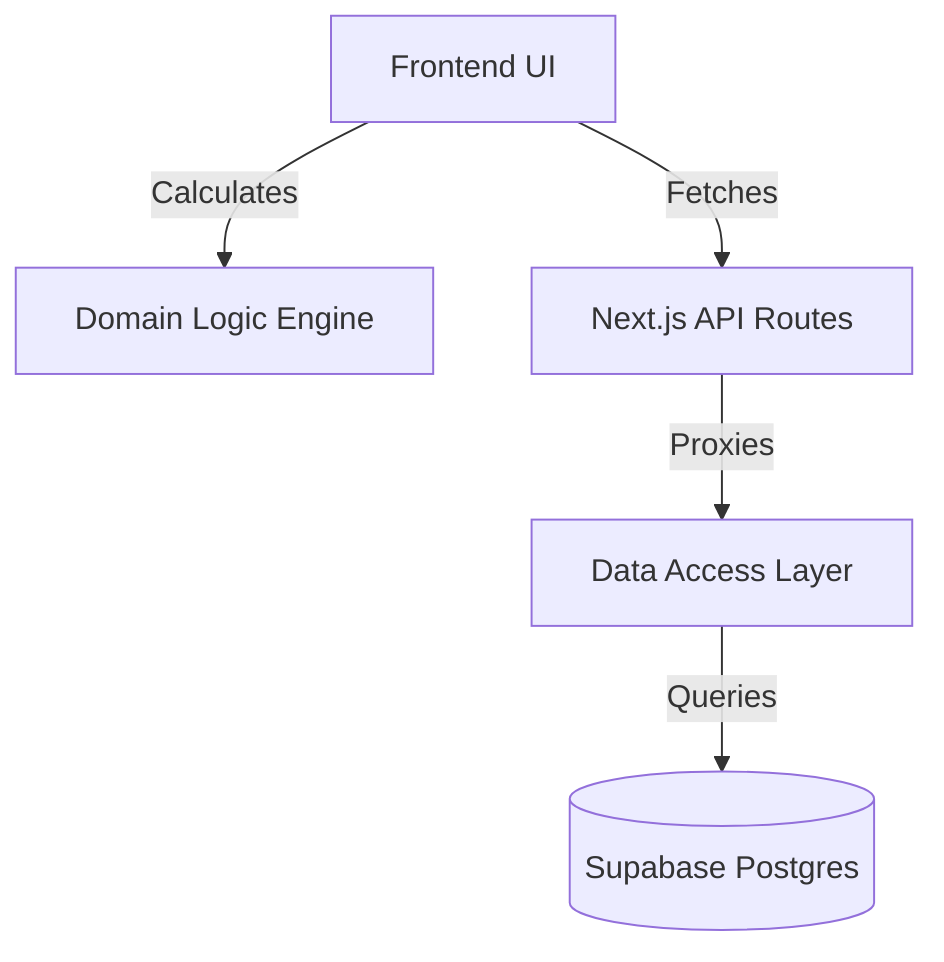

# System Architecture

## High-Level Overview
OptionsBookie is a **Next.js Monolith** using a "BaaS" (Backend-as-a-Service) model with Supabase.

## Key Components

### 1. Frontend Subsystem (`src/app`, `src/components`)
- **Responsibility:** orchestration, user input validation, and rendering.
- **Key Pattern:** "Smart" Page components fetch data, "Dumb" UI components render it.

### 2. Domain Logic Engine (`src/utils`)
- **Responsibility:** Financial math (P&L, RoR, Collateral) and Capital Efficiency detection.
- **Criticality:** High. This is the "secret sauce" of the app.

### 3. Data Access Layer (`src/lib`)
- **Responsibility:** Data sanitization and mapping.
- **Key Modules:**
  - `database-supabase.ts`: Main repository.
  - `stock-price-factory.ts`: Market data abstraction.

### 4. Security Layer
- **Responsibility:** Session validation (NextAuth) and Data validation (Postgres RLS).
- **Enforcement:** Both at the API edge (Middleware) and Storage engine (SQL).
